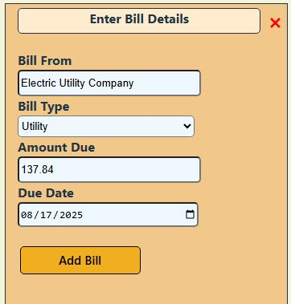
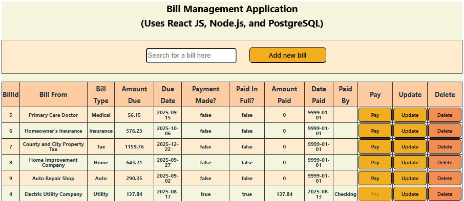
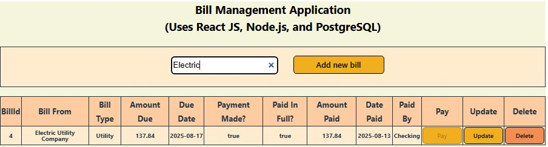
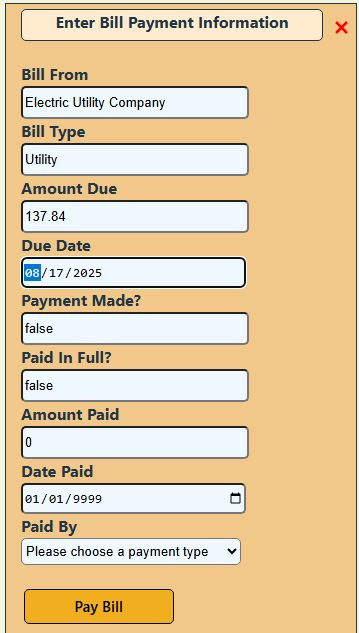
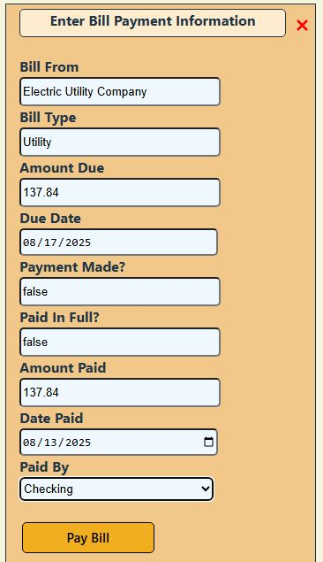
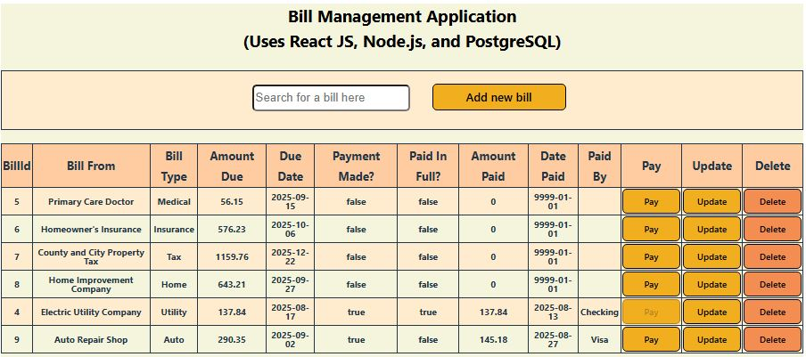
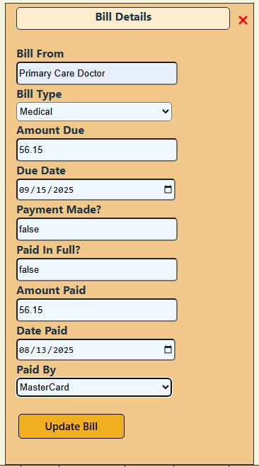
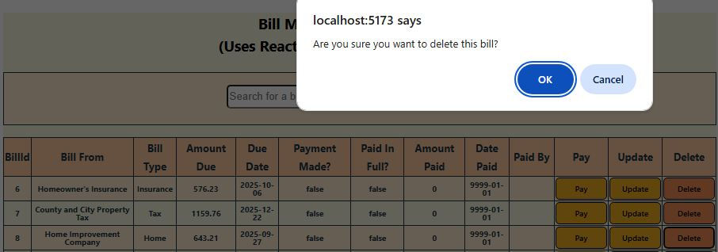

# Bill management application using Node.js, React, and PostgreSQL

This application is intended for personal bill management.  When a bill is received, details are entered and a new bill record is created.  Then there are options to record payment or update details of a bill.  The user interface uses React to control the HTML that is rendered.  The interface makes API calls to add and update bill information using a Node.js server.  Data is persisted from the server to a PostgreSQL database.

**Acknowledgement:** I followed the [tutorial](https://www.youtube.com/watch?v=GgFZXgAkJS4) from the "Code for Tech Solutions" YouTube channel which explains how to create a full stack application using Node.js, React, and PostgreSQL.  I adapted and extended the application created from following the tutorial to the bill management use case.


## Install prerequisistes

I used VSCode as the editor and I would suggest installing VSCode if you haven't already.

### Node.js installation

Visit the [Node.js download page](https://nodejs.org/en/download) to obtain a Node.js installer.  I would suggest using the latest long-term support release (which is v22.18.0 as of August 2025).  Peform the installation and make sure that the `node --version` command returns the expected version.

### PostgreSQL installation

Visit the [PostgreSQL download page](https://www.postgresql.org/download/) to obtain a PostgreSQL installer.  I chose to install version 17.5.

During the installation, note values that were entered or accepted.
1.  Make a note of the PostgreSQL super user.
2.  Record the password for the super user.
3.  Note tha database port that will be used.  I kept the default of port `5432`.
4.  Make a note of the locale setting.  I chose to keep `DEFAULT`.

I would suggest installing some additional packages.
- `pgAdmin` - This is a scheduling agent.
- `pgJDBC` - This includes JDBC drivers.
- `pgODBC` - This includes ODBC drivers.

### Postman installation

The Postman application is helpful for testing server-side APIs and confirming that data can be written to and retrieved from the database.  Visit the [Postman download page](https://www.postman.com/downloads/) to obtain Postman.

## Setup for the server portion of the application

### Initialization

1.  Create a `bill-mgmt-app` directory and open this directory in VSCode.
2.  Create a `bill-mgmt-server` directory that is a child of `bill-mgmt-app`.  This directory will contain the server logic for the application.
3.  Navigate to the `bill-mgmt-server` directory in a VSCode terminal and run `npm init -y`.  This will cause a `package.json` file to be created.

*Note:* If you are using Windows PowerShell, it might be necessary to grant different permissions to PowerShell (as explained [here](https://learn.microsoft.com/en-us/powershell/module/microsoft.powershell.core/about/about_execution_policies?view=powershell-7.5)).
- I ran `Get-ExecutionPolicy -List` to see the different execution policies that are available.
- Then I used the following command to change an execution policy: `Set-ExecutionPolicy -ExecutionPolicy Unrestricted -Scope CurrentUser`

### Install packages that the application depends upon

Run this command which installs the "experss", "nodemon", "cors", and "pg" packages: `npm install express nodemon cors pg`
The dependencies will be automatically recorded in the `package.json` file as a result of this command and the contents of the dependencies will be stored in the `node_modules` directory.
- `express` - Used with Node.js backend applications
- `nodemon` - Helpful for development as it detects code changes and automatically restarts the server
- `cors` - This is used for interacting with a backend server using a browser.
- `pg` - This is a model for interacting with the PostgreSQL database.

## Create the database, sequence, and table

Launch the `pgAdmin 4` interface and create a database named `bill_manager` in the `pg_default` tablespace (basically accept all of the defaults).  Following is the DDL.
```
CREATE DATABASE bill_manager
    WITH
    OWNER = postgres
    ENCODING = 'UTF8'
    LOCALE_PROVIDER = 'libc'
    CONNECTION LIMIT = -1
    IS_TEMPLATE = False;
```

Next add a `bills` table and setup the columns.
- This is done from `Schemas > Tables > Create Table`. 
- Following are column names and types.
  - `billid` - integer (primary key)
  - `billfrom` - character varying
  - `billType` - character varying
  - `amountDue` - double
  - `dueDate` - date
  - `isPaid` - boolean
  - `paidInFull` - boolean
  - `amountPaid` - double
  - `datePaid` - date
  - `paidBy` - character varying
- If you missed adding columns during the table create dialog, then go to TABLE_NAME > Properties to add missing columns.
- An easier way to create the table is to select the `bill_manager` database in the "PgAdmin 4" interface and choose `Query Tool`.  Then enter the DDL from the [bills-table-definition.sql](db-ddl/bills-table-definition.sql) file and chose to run the script to create the table.

Next create a sequence so that the primary key will be assigned automatically.  Name the sequence `bills_billid_seq` with a starting value of one and incrementing by one when a new record is added.  The sequence can also be created from the [bills_billid_seq-ddl.sql](db-ddl/bills_billid_seq-ddl.sql) file.

Issue a query against the table that was just created to confirm that it is empty.
- `TABLE_NAME > Query tool` can be used to issue a query.
- Following is an example query:
```
SELECT * FROM public.bills;
```

### Write the Node.js server code that has create, retrieve, update, and delete (CRUD) APIs

1.  Create a file named `server.js` to house the server logic.  The details of these steps are included in the code in `server.js` up to the point of APIs for the "CRUD" operations.
2.  Create constants to enumerate packages that the server will depend upon.
```
const express=require("express");
const cors=require("cors");
const postgresPool=require("pg").Pool;
const app=express();
// Body parser is used for parsing JSON
const bodyParser=require("body-parser");
```
3.  Setup a port: `const port=process.env.port || 3007;`
4.  Setup the Express app to use "cors" and "body-parser".
5.  Configure the application to listen on the port that was setup.
6.  Create a pool that will be used for connecting to the PostgreSQL database.
7.  Try connecting to the database.
8.  This is a good time to try starting the server.  In order to use the `nodemon` package to automatically restart the server when changes are made during development, edit the `package.json` file and change `scripts > start` to `nodemon server.js` instead of `node server.js` (or add the `start` script section if it doesn't already exist).

Write APIs for "CRUD" operations to interact with the database.  Following is a general pattern that will be used for creating APIs.
- Define the endpoint (like `/bills`) and specify that there will be a request and a response.
- Formulate a SQL query, such as: `const sql="select billid, billfrom, \"billType\", \"amountDue\", TO_CHAR(\"dueDate\", 'YYYY-MM-DD') AS \"dueDate\", \"isPaid\", \"paidInFull\", \"amountPaid\", TO_CHAR(\"datePaid\", 'YYYY-MM-DD') AS \"datePaid\", \"paidBy\" from bills";`  There are a couple of things to note about this query.  When a PostgreSQL colummn name has capital letters, it has to be enclosed in double quotes (which need to be escaped in JavaScript).  The "date" type in PostgreSQL stores the time as well; only the date is needed to correspond to an HTML inpupt field so the date is formatted to remove the time portion.
- Submit the query and pass in error and result objects.
    - If the query results in an error, return the JSON response with error information.
    - If the query is successful, return an HTTP 200 or 201 status code for success as well as the JSON results of the query.

Following is a list of the APIs for the billing application.  Only the `addbill`, `paybill`, and `updatebill` APIs need to have a request body passed in.  Details of these requests are included in the section below on testing.  All other APIs at most need a bill ID to reference in the API call itself.
- Retrieve all bills: GET /bills
- Retrieve one specifc bill: GET /bills/*insert bill ID*
- Retrieve the amount paid for one specific bill (not currently used by the UI): GET /bills/amountPaid/*insert bill ID*
- Add a new bill record: POST /addbill
- Pay a bill: PATCH /paybill/*insert bill ID*
- Update bill details: PATCH /updatebill/*insert bill ID*
- Delete a bill record: DELETE /bills/*insert bill ID*


## Test the server APIs to ensure the database is updated as expected

The Postman tool mentioned earlier will be used for testing the APIs.

1.  Under the `Collections` section on the left, click the plus sign to create a new collection.  In the address bar of the collection, enter the base URL that will be used for the APIs.  In this case it is `localhost:3007`.
2.  To try adding an entry, use the `POST` request for `http://localhost:3007/bills` and in the raw body section of the interface, enter JSON such as the following.  Only these four initial fields need to be specified when adding a bill.
```
{
        "billfrom": "Primary Care Doctor",
        "billType": "Medical",
        "amountDue": 56.15,
        "dueDate": "2025-09-15T04:00:00.000Z"       
}
```
3.  To view the results of the request, go to `Body > raw` and in the far-right type selection choose `JSON`.
4.  Choose the type of request, such as `GET` and enter the URL, such as `http://localhost:3007/bills` to get all bills or `http://localhost:3007/bills/1` to get the bill with a bill ID of one.  Then press the `Send` button.
5.  To try a `PATCH` request to update details of a bill, enter `http://localhost:3007/updatebill/1` to update the bill with an ID of one.  The `billfrom`, `billType`, `amountDue`, and `dueDate` fields need to be included at a minimum, but you can also include payment fields (`amountPaid`, `datePaid`, and `paidBy`).  The `isPaid` and `paidInFull` fields can be included, but they are not used to update the record as these values are determined programatically (if they are not included, the values are "undefined" which is all right).
```
{
        "billfrom": "Internal Medicine Doctor",
        "billType": "Medical",
        "amountDue": 56.15,
        "dueDate": "2025-09-15T04:00:00.000Z",
        "amountPaid": 15.57,
        "datePaid": "2025-08-10T04:00:00.000Z",
        "paidBy": "Visa"      
}
 ```
 6.  To try a `PATCH` request to pay a bill with an ID of one, enter `http://localhost:3007/paybill/1`.  The payment fields (`amountPaid`, `datePaid`, and `paidBy`) need to be passed in.  Also, the `amountDue` needs to be passed in for comparison purposes, otherwise the `paidInFull` field will not be updated programatically.  
 ```
 {
        "amountDue": 56.15,
        "amountPaid": 56.15,
        "datePaid": "2025-08-12T04:00:00.000Z",
        "paidBy": "Visa"      
 } 
 ```


## Create the user interface portion of the application

### Getting started

1.  Under the main `bill-mgmt-app` folder, create a new `bill-mgmt-web` folder which will contain the user interface portion of the application.
2.  Open a new terminal window in VSCode which and go to the `bill-mgmt-app` directory.
3.  Use the following command to install Vite: `npm create vite@latest bill-mgmt-web`  Vite provides a development build environment that makes it faster to deploy changes in Node.js code by skipping the full Node.js bundling process.
4.  Confirm that you want to install Vite and use down arrow to select `React` (it will be highlighted in green) and press enter.  Then use the down arrow to select `JavaScript`.
5.  Change directory to `bill-mgmt-web` and run `npm install`.
6.  Then run `npm run dev` which will initialize a user interface application.
7.  Go to `http://localhost:5173/` and it will show a page that says `Vite + React` which indicates that things are working correctly.
8.  Next, edit `bill-mgmt-web/src/App.jsx` to remove the initial content and give a starting point for creating the bill management user interface.
9.  Remove everything from `App.css` as this will be created from scratch.
10.  Modify `index.html` to change the title and remove a link to an svg file which isn't needed.

**Tip:** Using a "simple browser" in VSCode is an easy way to test the user interface while developing.  Go to the command palatte in VSCode by using Ctrl+Shift+P and then choose "simple browser."

### Setup imports in the App.jsx file and install Axios

Axios will be used to handle making HTTP requests from the user interface to server APIs.  Axios is a promise-based HTTP client that works with Node.js and a browser to simplify the process of making HTTP requests to external resources.

1.  Import React hooks that will be used.  In this case, "useState" and "useEffect" will be used: `import { useState, useEffect} from "react";`
2.  Import the cascading style sheet (CSS) that will be used to style the HTML output: `import './App.css';`
3.  Go to the `student-web` directory in a terminal and install Axios: `npm install axios`
4.  Then in the `App.jsx` file, import Axios: `import axios from "axios";`

### Create a function, export it, and start setting up constants

1.  The function will be named `App`.
```
function App(){   
}
```
2.  Export the function to make it available to other files: `export Default App`
3.  Setup constants that will use React hooks, for example: `const [bills,setBills]=useState([]);`

### Create functions that handle selected UI elements and call server APIs

Create functions that handle each unique action that can be taken on a UI element, such as clicking a button.  Refer to the App.jsx file for all of the functions.

The following example shows a function to display a pop-up div section when a "Pay" button is clicked to pay a bill.
```
const openPayPopup=()=>{
    setIsPayModalOpen(true);
  };
```

Next is an example of a function that calls an API when a submission button is clicked after entering payment details for a bill.
```
// Handle what happens after clicking the submit button when paying a bill.
  const handlePaySubmit=async (e)=>{

    // Prevent the default event action from happening.
    e.preventDefault();

    // Display an error message if the threee fields that are specific to paying a bill are not completed.
    let errMsg="";
    if (!billData.amountPaid || !billData.datePaid || !billData.paidBy) {
      errMsg="The Amount Paid, Date Paid, and Paid By fields are required when paying a bill!";
      setErrorMsg(errMsg);
    }

    // Make sure there isn't an error of incomplete input before either adding or updating an entry.
    if (errMsg.length==0) {
      // Mark the bill paid.
      // Note the use of backticks here since a substituted value is being passed.
      await axios.patch(`http://localhost:3007/paybill/${billData.billid}`,billData).then((res)=>{
      console.log(res.data);
      });

      // Make sure the pop-up window for paying is closed when adding payment information is successful.
      // The pop-up won't be closed if there is an error so that it is possible to view the error.
        handlePayClose();
    }
  };
  ```

### Return HTML that is dynamically rendered based on using the React useState hook

Create an HTML layout for the user interface.  You can use static data when first prototyping the interface if it is helpful.  Then embed JavaScript in the HTML within curly braces (`{}`) to control field values and which parts of the markup are displayed.

First is an example of how field values for input fields are determined dynamically.
```
return (<tr key={bill.billid}>
                <td>{bill.billid}</td>
                <td>{bill.billfrom}</td>
                <td>{bill.billType}</td>
                <td>{bill.amountDue}</td>
                <td>{bill.dueDate}</td>
                <td>{bill.isPaid.toString()}</td>
                <td>{bill.paidInFull.toString()}</td>
                <td>{bill.amountPaid}</td>
                <td>{bill.datePaid}</td>
                <td>{bill.paidBy}</td>
                ...
```

Next is an example of using a boolean value from JavaScript to determine if a div element will be displayed.
```
{isPayModalOpen && <div className='paypopup'>
              <span className='closeBtn' onClick={handlePayClose}>&times;</span>
              <h4>Enter Bill Payment Information</h4>
              <div className='popupdiv'>
                <label className='popuplabel' htmlFor="billfrom">Bill From</label>
                <input className='popupinput' value={billData.billfrom} onChange={handleChange} type="text" name="billfrom" id="billfrom" readOnly/>
              </div>
              ...
          </div>}
```

## Using the user interface

Open the user interface by navigating to `http://localhost:5173` in a browser.

### Add a new bill

1.  To add a bill, click the `Add new bill` button in the top bar of the interface.
2.  Complete the `Bill From` field with the name of the billing entity, select a bill type from the `Bill Type` drop-down list, enter the amount due (floating point field), and select the due date (you can use the date picker).



### Using the bill list

The bill list shows all bill information in a tabular form.
- The `Bill From"`, `Bill Type`, `Amount Due`, and `Due Date` columns always have values based on initial input.  
- The `Payment Made?` field is updated programatically if a partial payment is made and `Paid In Full?` is updated programatically if full payment is made.
- The `Amount Paid`, `Date Paid`, and `Paid By` values are set at the time a bill is paid (or updated).  The `Date Paid` column has an initial value of `9999-01-01` to avoid problems with an empty date.
- There are `Pay` (disabled if paid in full), `Update`, and `Delete` buttons that cause different dialogs to be displayed to change bill information.

Following is the bill list after one bill has been paid in full.


### Search for a bill

Enter any text string and a string-based search bill be conducted for all fields to show bills that have matching information.

Below is an illustration of searching for the word `Electric`.


### Pay a bill

Enter values in the `Amount Paid`, `Date Paid`, and `Paid By` fields.  The rest of the fields are read only and the details match what was entered previously.  There is no need to set `Payment Made?` and `Paid In Full?` because these values are set programatically.

The payment panel looks like this before entering payment information:


The payment panel looks like this after entering payment information:


The bill list will reflect changes to the `Payment Made?` and `Paid In Full?` columns and the `Pay` button will be disabled if the bill has been paid in full.


### Update details of a bill

The update option allows editing of initial fields for a bill as well as payment information.  The purpose is to allow correction of any information that was entered incorrectly.  The "Payment Made?" and "Paid In Full" fields are read-only since these values are set programatically by the server API depending on whether the payment amout equals the amount due.

Following is an illustration of updating all fields that are writable.


### Delete a bill

Select the "Delete" button on the row for the bill that you wish to delete.  A pop-up confirmation dialog will be displayed asking if you want to delete the bill.

Below is an illustration of the deletion confirmation dialog.  Also note that the "Delete" button has focus for the bill that is being deleted.

